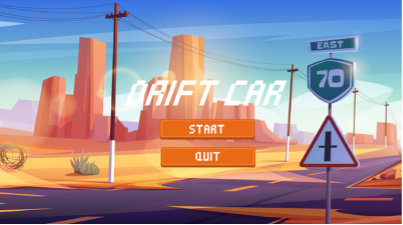
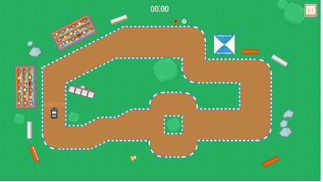
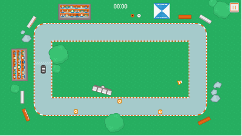
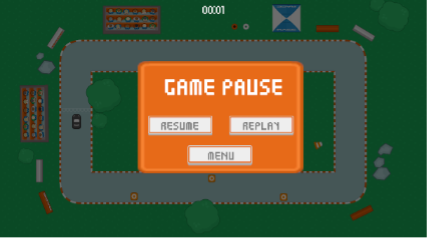
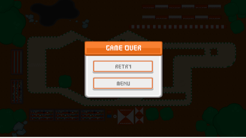
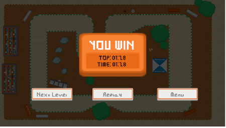

# Driff Car Game - 2D Racing Game

## Description

This is a 2D racing game developed using **Unity** and **C#**, offering an engaging and entertaining experience for players. The game, titled **Driff Car**, features a series of increasingly challenging levels where players control a car to navigate tracks, avoid obstacles, and reach the finish line. The game includes intuitive controls, smooth gameplay, and a user-friendly interface, designed to run efficiently on low-spec hardware.

---

## Related Repositories

This project is a standalone application developed as part of a university assignment. No additional repositories are directly related, but the source code and assets can be found in the project's repository:


---

## Preview

### 1. Game UI


### 2. Key Features
#### Game levels



#### Game Paused


#### Game Over


#### You Win


---

### Features

- **Multiple Levels:** Six progressively challenging levels with unique track designs.
- **Intuitive Controls:** Use arrow keys (←, ↑, →, ↓) to control the car’s movement.
- **Physics-Based Gameplay:** Realistic car movement using Unity’s Rigidbody2D and custom physics parameters (drift, acceleration, and turn factors).
- **Game States:** Includes Menu, Pause, Game Over, and You Win screens for a complete gaming experience.
- **Timer System:** Tracks and saves the fastest completion time for each level.
- **Responsive Design:** Lightweight and optimized for smooth performance on various devices.

---

## Table of Contents

- [Getting Started](#getting-started)
- [Prerequisites](#prerequisites)
- [Installation](#installation)
- [Configuration](#configuration)
- [Run the Project](#run-the-project)
- [Usage](#usage)
- [Tech Stack](#tech-stack)
- [License](#license)

---

## Getting Started

Follow these steps to set up and run the project locally.

---

## Prerequisites

Ensure you have the following installed on your system:

- **Unity Hub:** For managing Unity versions and projects.
- **Unity Editor:** Version 2021.3 or higher (recommended, check project settings for exact version).
- **Visual Studio** or **Visual Studio Code:** For editing C# scripts.
- **Git:** For cloning the repository (optional).

---

## Installation

1. Clone the repository to your local machine (if available):

   ```bash
   git clone https://github.com/TuananhDo0308/driff-car-game.git
   cd driff-car-game
   ```

2. Open the project in Unity:

   - Launch **Unity Hub**.
   - Click **Add** and select the cloned project folder.
   - Open the project with the recommended Unity Editor version.

3. Install required Unity packages:

   - Ensure Unity’s **2D Physics** and **UI** modules are enabled in the Unity Editor.
   - No additional external packages are required.

---

## Configuration

1. Verify project settings:

   - Open the project in Unity and check **Build Settings** to ensure the target platform is set (e.g., Windows, macOS, or Linux).
   - Confirm that all assets (images, scripts, and prefabs) are correctly linked in the Unity Editor.

2. Adjust game parameters (optional):

   - Modify car physics parameters (`driftFactor`, `accelerationFactor`, `turnFactor`, `maxSpeed`) in the relevant C# scripts (e.g., `CarController.cs`) to tweak gameplay.
   - Update level designs or add new levels by editing scenes in the Unity Editor.

---

## Run the Project

### Development

1. Open the project in Unity Editor.
2. Navigate to the **Scenes** folder and open the main scene (e.g., `MenuScene`).
3. Click the **Play** button in the Unity Editor to test the game.

### Build and Run

1. Build the project:
   - Go to **File > Build Settings**.
   - Select your target platform (e.g., Windows, macOS).
   - Click **Build** and choose an output folder.

2. Run the built executable:
   - Locate the generated `.exe` (Windows) or equivalent file in the output folder.
   - Double-click to launch the game.

---

## Usage

Once the game is running, players can:

- Start the game from the **Menu** by selecting **Start**.
- Navigate through six levels, controlling the car with arrow keys to avoid obstacles and stay on the track.
- Pause the game using the **Pause** button in the top-right corner.
- Retry or return to the menu upon **Game Over** or **You Win**.
- Aim to achieve the fastest completion time, which is saved for each level.

---

## Tech Stack

The project uses the following technologies:

- **Unity:** Game engine for 2D rendering, physics, and scene management.
- **C#:** Primary programming language for game logic and mechanics.
- **Unity 2D Physics (Rigidbody2D):** For realistic car movement and collision detection.
- **Unity UI:** For creating menus, pause screens, and game state displays.
- **Asset Packages:** Custom 2D sprites (sourced from [Kenny](https://www.kenney.nl/assets/category:2D)) for tracks, cars, and backgrounds.

---

## License

This project is licensed under the [MIT License](LICENSE).

---

## Acknowledgments

- **Instructor:** Trần Thanh Nhã, for guidance and support during the project.
- **Team Members:**
  - Đỗ Trần Tuấn Anh: Front-end design, back-end coding, level design, and presentation.
  - Trần Quốc Ấn: Game research and level design.
  - Trịnh Quang Minh: Game research, level design, and report writing.
  - Trần Quốc Long: Game research, front-end design, and PowerPoint creation.
- **References:**
  - [C# Overview by Bizfly](https://bizfly.vn/techblog/c-la-gi.html)
  - [C# and .NET Introduction by Tự Học Lập Trình](https://tuhoclaptrinh.edu.vn/gioi-thieu-ve-ngon-ngu-c-va-cong-nghe-net-1049.html)
  - [Kenny Assets](https://www.kenney.nl/assets/category:2D)
  - [Unity 2D Car Controller Tutorial by Pretty Fly Games](https://www.youtube.com/watch?v=DVHcOS1E5OQ&list=PLyDa4NP_nvPfmvbC-eqyzdhOXeCyhToko)

---

This **Driff Car** game is a fun and lightweight racing experience, perfect for casual gamers and students learning game development with Unity and C#. Happy racing! 🚗
